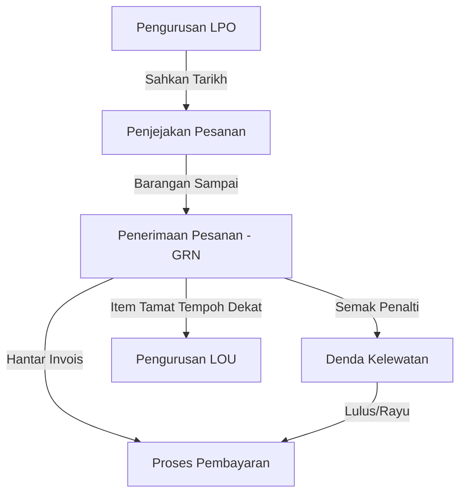

# Manual Pengguna: Modul Perolehan (Procurement)

Selamat datang ke Manual Pengguna Sistem Pengurusan Operasi Hospital. Dokumen ini akan membimbing anda langkah-demi-langkah dalam menggunakan **Modul Perolehan**.

---

## 1. Aliran Kerja Keseluruhan (Workflow)

Sistem Perolehan ini direka untuk memastikan setiap pesanan dikesan dari mula hingga tamat (pembayaran). Berikut adalah aliran kerja utama:

---

## 2. Pengurusan LPO (LPO Management)

Halaman ini merupakan pusat kawalan untuk semua Pesanan Kerajaan (LPO).

### Langkah Penggunaan:
1. **Melihat Senarai**: Semua LPO yang diimport atau dicipta akan dipaparkan di sini.
2. **Sahkan Tarikh**: Klik butang **"Verify"** untuk mengesahkan Tarikh Dokumen LPO. Ini penting untuk pengiraan penalti yang tepat.
3. **Tukar Nama LPO**: Jika terdapat kesilapan nombor LPO, gunakan fungsi **"Rename"**.
4. **Penyelarasan Tarikh (Batch Sync)**: Anda boleh menyelaraskan tarikh untuk banyak LPO sekaligus menggunakan butang **"Sync Dates"**.

> [!TIP]
> Pastikan Tarikh Dokumen (Document Date) adalah sama dengan tarikh yang tertera pada PDF LPO fizikal untuk mengelakkan ralat penunjukan status "Overdue".

---

## 3. Penjejakan Pesanan (Order Tracking)

Gunakan halaman ini untuk memantau status penghantaran barangan dari pembekal.

### Ciri-ciri Utama:
- **Status Penghantaran**: Pantau sama ada item adalah *In Transit*, *Delivered*, atau *Overdue*.
- **Amaran Kelewatan**: Sistem akan memaparkan tanda amaran jika pembekal melepasi tarikh jangkaan penghantaran.
- **Surat Peringatan**: Anda boleh menjana **Surat Peringatan** secara automatik kepada pembekal jika penghantaran lewat.

---

## 4. Penerimaan Pesanan (Order Receiving / GRN)

Proses ini dilakukan apabila barangan sampai di stor/farmasi.

### Langkah-langkah:
1. **Cari Pesanan**: Masukkan nombor LPO atau imbas Kod QR.
2. **Masukkan Kuantiti**: Isi jumlah barangan yang diterima.
3. **Maklumat Batch & Luput**: Masukkan **Nombor Batch**, **Tarikh Dikilangkan**, dan **Tarikh Luput**.
4. **Muat Naik DO**: Masukkan nombor *Delivery Order* (DO) dan muat naik imbasan dokumen DO untuk rujukan masa hadapan.
5. **Simpan (Submit)**: Klik **"Receive"** untuk merekodkan kemasukan stok.

---

## 5. Denda Kelewatan (Late Delivery Penalties)

Sistem secara automatik mengesan penghantaran yang lewat berdasarkan perbandingan Tarikh LPO dan Tarikh GRN.

### Pengurusan Penalti:
- **Semakan Otomatik**: Sistem mengira denda berdasarkan kadar peratusan nilai item bagi setiap hari kelewatan.
- **Kelulusan (Approval)**: Pegawai boleh meluluskan denda atau memberi pengecualian (**Waive**) jika terdapat alasan kukuh dari pembekal.
- **Eksport Laporan**: Laporan denda boleh dieksport untuk proses pemotongan bayaran.

---

## 6. Proses Pembayaran (Payment Processing)

Langkah terakhir untuk menghantar dokumen ke Unit Kewangan untuk pembayaran.

### Cara Membayar:
1. Pilih LPO yang telah selesai diterima barangan sepenuhnya.
2. Klik butang **"Submit for Payment"**.
3. Masukkan maklumat tambahan seperti **No. Invois**, **No. eGRN**, dan pastikan tarikh adalah betul.
4. Sistem akan menukar status LPO kepada **"Paid"** setelah proses disahkan.

---

## 7. Pengurusan LOU (LOU Management)

Untuk barangan yang mempunyai tarikh luput kurang dari 18 bulan, pembekal wajib memberikan **Letter of Undertaking (LOU)**.

- **Penjanaan LOU**: Sistem boleh menjana template LOU untuk pembekal tandatangani.
- **Tracking**: Pantau LOU yang belum diterima untuk memastikan keselamatan stok terjamin.

---

> [!IMPORTANT]
> Sila pastikan semua maklumat batch dan tarikh luput dimasukkan dengan tepat untuk memudahkan proses pusingan stok (stock rotation).
