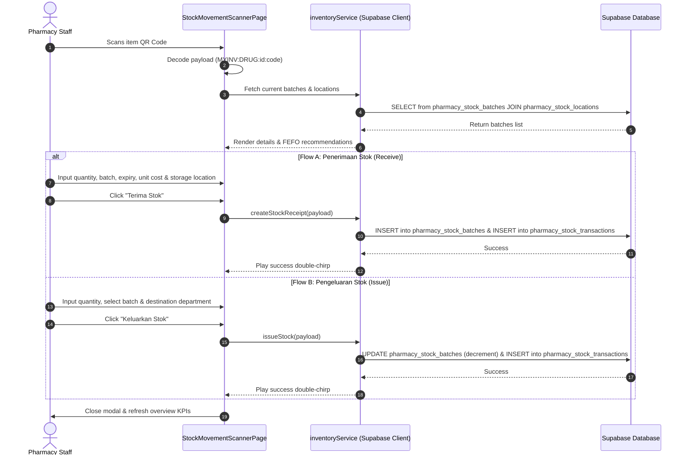

# Detailed Implementation Plan: MyInventory Management System

This document outlines the detailed plan to rebuild and expand the **MyInventory** module. This module will serve as a complete, modern replacement for the outdated manual government ledger card system (**Kad Petak KEW.PS-4**), enabling physical movement monitoring, QR code tagging, barcode-based receiving and issuing, warning alerts, usage forecasting, and location tracking.

The design language, colors, and layout will strictly follow the existing modules (e.g. MyKunci, MySuhu) to ensure visual coherence and user familiarity.

---

## 1. System Architecture & Flows

### ASCII System Architecture

```
                          [ MYINVENTORY MODULE ]
                                    │
         ┌──────────────────────────┼──────────────────────────┐
         ▼                          ▼                          ▼
 ┌───────────────┐          ┌───────────────┐          ┌───────────────┐
 │   DASHBOARD   │          │ MASTER CATALOG│          │ MOVEMENT FLOW │
 │ (Overview/KPI)│          │ (Drugs/Items) │          │ (Receipts/Out)│
 └───────┬───────┘          └───────┬───────┘          └───────┬───────┘
         │                          │                          │
         ▼                          ▼                          ▼
 ┌───────────────┐          ┌───────────────┐          ┌───────────────┐
 │  Usage Alerts │          │  QR Generator │          │  QR Scanner   │
 │ (Expiry/Buffer)          │ (Labels Print)│          │ (Camera Feed) │
 └───────┬───────┘          └───────┬───────┘          └───────┬───────┘
         │                          │                          │
         ▼                          ▼                          ▼
 ┌───────────────┐          ┌───────────────┐          ┌───────────────┐
 │  Forecasting  │          │  KEW.PS-4 Card│          │  Transactions │
 │  & Purchase   │          │ (Ledger Sheet)│          │  (Stock Log)  │
 └───────────────┘          └───────────────┘          └───────────────┘
```

### Sequence Flow: Scanning Movement



---

## 2. Domain Summary & Invariants

1. **Domain Invariant 1 (Strict Double-Entry Log)**: No stock can be added, removed, or transferred without logging an entry in the `pharmacy_stock_transactions` table referencing the physical batch, location, and the operating staff UUID.
2. **Domain Invariant 2 (FEFO - First Expiring, First Out)**: The issuing workflow must automatically prompt and highlight the batch with the nearest expiry date first.
3. **Domain Invariant 3 (Non-Negative Stock)**: The active `quantity_on_hand` in a batch cannot go below zero. Transaction writes must enforce checking this condition.
4. **Primary Actors**:
   - *Pegawai Farmasi (Pharmacist)*: Oversees inventory audit, runs reports, reviews warning alerts, and approves replenishment lists.
   - *Penolong Pegawai Farmasi (Assistant Pharmacist) / Stor Staff*: Handles the day-to-day scanning, receiving shipments, issuing item bags to wards, and printing barcode labels.

---

## 3. Database Schema Mapping

We will leverage the existing tables in the database:
- `drugs` (Master Drugs list): `id`, `drug_code`, `drug_name`, `generic_name`, `min_stock_level`, `max_stock_level`, `reorder_level`.
- `non_drugs` (Non-Drug inventory catalog): `id`, `item_code`, `item_name`, `category_id`, `unit_of_measure`, `min_stock_level`, `max_stock_level`.
- `pharmacy_stock_locations` (Inventory locations): `id`, `location_code`, `location_name`, `location_type` (warehouse, pharmacy, ward, cold_room, controlled), `is_active`.
- `pharmacy_stock_batches` (Individual batches): `id`, `hospital_id`, `item_type` ('drug'|'non_drug'), `item_id`, `batch_number`, `manufacturing_date`, `expiry_date`, `quantity_received`, `quantity_on_hand`, `quantity_reserved`, `unit_cost`, `location_id`, `status` ('available', 'quarantine', 'expired', 'depleted'), `received_date`, `supplier_id`.
- `pharmacy_stock_transactions` (Movement history): `id`, `hospital_id`, `transaction_number`, `transaction_type` ('receipt', 'issue', 'transfer_in', 'transfer_out', 'adjust', 'return', 'dispose'), `transaction_date`, `item_type`, `item_id`, `batch_id`, `quantity`, `from_location_id`, `to_location_id`, `reference_type` (LPO, requisition, etc.), `reason`, `performed_by`.

---

## 4. UI Layout & Design Tokens

We will replicate the layout patterns of the **MyKunci** and **MySuhu** modules:
1. **Header Panel**: Uses a prominent white panel card (`bg-white border border-slate-100 rounded-3xl p-6 shadow-xl relative overflow-hidden`) with a top accent gradient border (`bg-gradient-to-r from-teal-400 via-teal-500 to-emerald-500`).
2. **KPI Metrics Grid**: A 5-column grid (`grid-cols-2 md:grid-cols-5 gap-4`) for metrics. Each card will have a left border highlighting:
   - *Total Items* (Gray)
   - *Active Stock Value* (Teal)
   - *Low Stock Warning* (Amber)
   - *Near Expiry Batches* (Red)
   - *Slow-Moving Items* (Indigo)
3. **Typography**: Clean hierarchy using `Plus Jakarta Sans` or `Inter`, using tabular numbers (`font-variant-numeric: tabular-nums`) for columns with numeric data.
4. **Empty State Components**: Descriptively designed with icons, informative titles, helper text, and a primary call-to-action button (e.g. "Scan QR").
5. **Loading States**: Shimmer effect skeletons mapping exactly to the components they replace.

---

## 5. Implementation Roadmap

### Phase 1: Service Enhancements & QR Code Printing
- Install client-side generator `qrcode` and its types.
- Update `inventoryService.ts` to implement:
  - Database-backed fetching for batches (`getDrugs`, `getNonDrugs`, etc.) instead of mock fallbacks.
  - Receipt creation, batch updates, and transaction logging.
- Add a QR generator modal in both drug and non-drug master catalog lists. Include standard print styling template cards to print adhesive shelf tags.

### Phase 2: QR Scanner and Transaction Forms
- Implement a `StockMovementScannerPage.tsx` containing:
  - The live camera stream viewfinder with `jsQR` decoding the payload format (`MYINV:[TYPE]:[ID]:[CODE]`).
  - Web Audio API synthesizer for scan confirmations (chirp vs buzzer).
  - Manual key-in panel fallback for damaged barcodes.
  - Receipt entry form (inputs: Batch, Expiry, Qty, Cost, Location).
  - Issuing form (FEFO sorting, inputs: Qty, Destination).

### Phase 3: Digital KEW.PS-4 Ledger (Kad Petak)
- Create a printable table listing chronological transactions matching the Malaysian government standard format (date, reference number, transaction type, quantity change, baki_semasa, performed_by).
- Calculate stock balances incrementally or query the transaction logs.

### Phase 4: Warning Alerts & Analytical Engines
- Implement warning cards for batches expiring within 6/3/1 months.
- Implement warning cards for items whose total quantity across all batches drops below their `min_stock_level`.
- Implement a usage forecasting card based on a 6-month historical rolling Average Monthly Consumption (AMC) and calculate "days of stock remaining".
- Implement purchase recommendations based on `max_stock_level` minus current stock when inventory hits the `reorder_level`.

---

## 6. Verification & Test Plan

- **FIFO / FEFO logic validation**: Unit tests to verify that batches are correctly sorted by expiry date for issuing recommendations.
- **Negative Stock validation**: Integration tests to confirm database transactions reject attempts to issue more than the `quantity_on_hand` in a batch.
- **Ledger Verification**: Manually log transactions using the barcode scanner and confirm that the digital KEW.PS-4 table correctly adds/subtracts values and updates the remaining balance.
