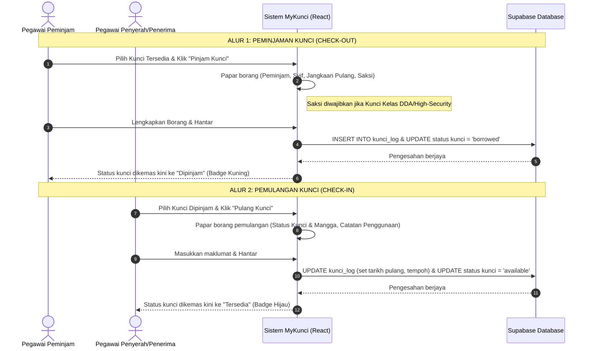

# Pelan Pembangunan: Modul MyKunci (Integrated Key Management System)
Sistem Pengurusan Kunci Bersepadu untuk Hospital Operation Management Ecosystem (HOME).

Sistem ini direka bentuk selaras dengan **Polisi Kunci Kementerian Kesihatan Malaysia (KKM)** dan **Jabatan Kesihatan Negeri Sarawak (JKNS)** untuk memastikan kawalan keselamatan kunci fizikal jabatan (seperti Farmasi Logistik, Stor Vaksin, Peti Dadah Narcotic/DDA) dapat direkodkan, dipantau, dan diaudit secara digital.

---

## 1. Polisi Kunci KKM & JKNS Sarawak (Domain Invariants)

Berdasarkan garis panduan keselamatan fizikal KKM:
1. **Daftar Kunci (Buku Rekod Kunci)**: Setiap jabatan mesti mempunyai daftar induk bagi semua anak kunci dan ibu kunci.
2. **Penyimpanan Kunci Pendua**: Kunci pendua (duplicate keys) hendaklah disimpan dalam sampul surat bermateri (sealed envelope) dan diletakkan di dalam peti keselamatan untuk kegunaan kecemasan sahaja.
3. **Larangan Dibawa Pulang**: Kunci premis kerajaan dilarang keras dibawa balik ke rumah. Semua peminjaman kunci mesti dipulangkan sebelum kakitangan tamat syif bekerja.
4. **Kawalan Kunci Kawasan Sensitif (Double Custody)**: Peminjaman kunci untuk kawasan kawalan khas (seperti peti ubat kawalan/DDA di Farmasi) memerlukan pengesahan dua pegawai (Peminjam dan Saksi/Pegawai Kedua).
5. **Jejak Audit Tidak Boleh Dipadam**: Semua log peminjaman dan pemulangan kunci adalah kekal untuk tujuan audit MSQH dan tidak boleh dipadamkan.

---

## 2. Alur Proses Peminjaman & Pemulangan (Sequence Diagram)

Berikut merupakan alur operasi peminjaman (check-out) dan pemulangan (check-in) kunci di dalam sistem:



---

## 3. Reka Bentuk Antaramuka Pengguna (UI Layouts)

### A. Sub-Menu Hub Utama (HubLayout)
Menu navigasi dari Hub utama (/hub/kunci) yang bertema gelap (Slate-950) dan responsif:

```
+-----------------------------------------------------------------------------------------+
|  <- Kembali ke Hub Utama                                                                |
|                                                                                         |
|  [Key Icon]  MYKUNCI                                                [Sub-modul KKM/JKNS] |
|              Sistem Pengurusan Kunci Bersepadu                                          |
|                                                                                         |
|  Ringkasan Semasa:                                                                      |
|  +--------------------+  +--------------------+  +--------------------+                 |
|  | Jumlah Kunci Aktif |  | Kunci Dipinjam     |  | Amaran Kelewatan   |                 |
|  |       24 Kunci     |  |      5 Kunci       |  |     1 Kunci [!]    |                 |
|  +--------------------+  +--------------------+  +--------------------+                 |
|                                                                                         |
|  Menu Pilihan:                                                                          |
|  [ Papan Pemuka Operasi (Dashboard) ] -> Membuka dashboard operasi harian               |
|  [ Daftar Kunci & Inventori ]        -> Mengurus pendaftaran kunci                      |
|  [ Log Pergerakan Kunci ]            -> Melihat rekod pinjam & pulang kunci             |
|  [ Audit & Verifikasi Bulanan ]      -> Melakukan semakan audit fizikal kunci           |
|  [ Rujukan Polisi Keselamatan ]      -> Panduan & peraturan pengurusan kunci            |
|                                                                                         |
+-----------------------------------------------------------------------------------------+
```

### B. Dashboard Operasi Kunci (MainLayout - Light Theme)
Reka bentuk bertema cerah (Slate-50) yang selaras dengan bahagian modules lain. Memaparkan peringatan penting, statistik dan senarai kunci aktif:

```
+-----------------------------------------------------------------------------------------+
|  MyKunci > Dashboard                                                                    |
|  PAPAN PEMUKA PENGURUSAN KUNCI JABATAN                                                  |
|                                                                                         |
|  +------------------+  +------------------+  +------------------+  +------------------+ |
|  | Jumlah Kunci     |  | Kunci Tersedia   |  | Aktif Dipinjam   |  | Overdue (Sangkut)| |
|  |      24          |  |      17          |  |       5          |  |       2 [!]      | |
|  +------------------+  +------------------+  +------------------+  +------------------+ |
|                                                                                         |
|  [!] Peringatan Polisi: Sila pastikan semua kunci dipulangkan sebelum tamat syif syif.  |
|                                                                                         |
|  +------------------------------------------+  +-------------------------------------+  |
|  | SENARAI KUNCI AKTIF DIPINJAM             |  | TINDAKAN PANTAS                     |  |
|  | +------------+-------------+-----------+ |  |                                     |  |
|  | | Kod Kunci  | Peminjam    | Jam Ambil | |  | [+] Daftar Kunci Baru               |  |
|  | +------------+-------------+-----------+ |  | [->] Rekod Pinjaman Kunci           |  |
|  | | KUN-PH-01  | Farhan (Ph) | 09:15 AM  | |  | [<-] Rekod Pemulangan Kunci         |  |
|  | | KUN-DD-03  | Amirul (Ph) | 08:30 AM* | |  | [Q] Carian Status Kunci             |  |
|  | +------------+-------------+-----------+ |  +-------------------------------------+  |
|  | * Merah: Melebihi jangkaan pulangan      |                                           |
|  +------------------------------------------+                                           |
+-----------------------------------------------------------------------------------------+
```

---

## 4. Pelan Struktur Fail & Perubahan Kod

Kami akan membina modul ini menggunakan pola struktur standard yang digunapakai oleh modul-modul lain (seperti `mysuhu` dan `mywarrant`):

```
src/
├── shared/
│   ├── types/
│   │   ├── mykunci.ts                    <- [BARU] Definisi interface data kunci & log
│   │   └── index.ts                      <- Eksport fail jenis mykunci
│   └── constants/
│       └── routes.ts                     <- Tambah pemalar URL laluan MyKunci
├── routes/
│   └── routes.tsx                        <- Daftar laluan (sub-routes) di bawah MainLayout
└── modules/
    └── mykunci/                          <- [BARU] Bounded Context Modul MyKunci
        ├── index.ts                      <- Eksport halaman & servis utama
        ├── services/
        │   └── kunciService.ts           <- Servis penyambung Supabase & fallback LocalStorage
        └── pages/
            ├── KunciDashboardPage.tsx    <- Dashboard utama (Statistik & borang tindakan)
            ├── KunciRegistryPage.tsx     <- Inventori & pendaftaran kunci induk
            ├── KunciLogPage.tsx          <- Log transaksi peminjaman & sejarah
            ├── KunciAuditPage.tsx        <- Rekod audit & verifikasi sampul bermeterai
            └── KunciPolicyPage.tsx       <- Halaman rujukan polisi KKM/JKNS Sarawak
```

---

## 5. Struktur Pangkalan Data Supabase (PostgreSQL Schema)

Sila rujuk migration file `044_create_mykunci_tables.sql` untuk kod lengkap. Secara ringkas, jadual berikut akan dibina:

1. **`kunci_daftar`**
   - Mengandungi butiran kunci fizikal induk.
   - Status kunci dikawal menerusi CHECK constraint: `available`, `borrowed`, `damaged`, `lost`.
   - Tahap kawalan kunci (`tahap_kawalan`): `normal` atau `high` (untuk DDA).

2. **`kunci_log`**
   - Merekodkan transaksi peminjaman kunci.
   - Mengira tempoh peminjaman (`duration_seconds`) semasa kunci dipulangkan.
   - Merekodkan keadaan kunci dan mangga (`keadaan_kunci`, `keadaan_mangga`) serta sebarang insiden (`catatan_penggunaan`).

3. **`kunci_audit_bulanan`**
   - Menyimpan rekod verifikasi fizikal bulanan.
   - Merekodkan status integriti sampul surat bermateri bagi kunci pendua keselamatan tinggi.

---

## 6. Pelan Pengesahan (Verification Plan)

### A. Ujian Automasi
Lakukan semakan untuk memastikan kod dibina dengan bebas ralat kompilasi TypeScript:
```powershell
npm run build
```

### B. Ujian Manual Senario
1. **Daftar**: Tambah kunci baharu dalam menu "Daftar Kunci" (cth: `KUN-PH-LOG-01` bagi Farmasi Logistik).
2. **Pinjam**: Klik "Rekod Pinjaman" pada dashboard. Pilih kunci tersebut, masukkan peminjam, tujuan, syif, jangkaan pulangan, dan pegawai penyerah.
3. **Semakan**: Pastikan status kunci berubah ke `Dipinjam` (Badges Kuning) dan masuk ke dalam senarai "Kunci Aktif Dipinjam" di Dashboard.
4. **Pulang**: Klik "Rekod Pemulangan" untuk kunci yang aktif. Masukkan keadaan kunci, mangga, catatan laporan insiden penggunaan.
5. **Log**: Periksa tab "Log Pergerakan" untuk memastikan tempoh masa pengunaan dikira secara automatik dan rekod insiden berjaya didaftarkan.
6. **Audit**: Melakukan audit bulanan dan menukar status meterai sampul kunci pendua dari `sealed` kepada `broken` jika diuji, lalu merekodkannya.
7. **Offline**: Nyahsambungkan Supabase dan pastikan simpanan data beralih ke mod `localStorage` secara automatik tanpa menyebabkan aplikasi terhenti (crash).
