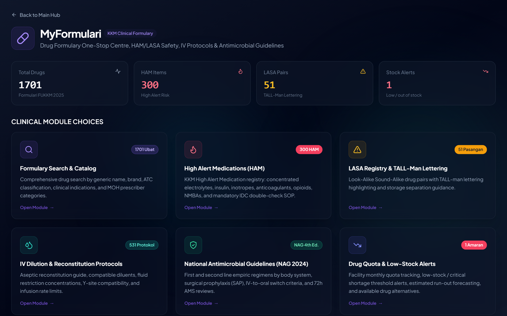
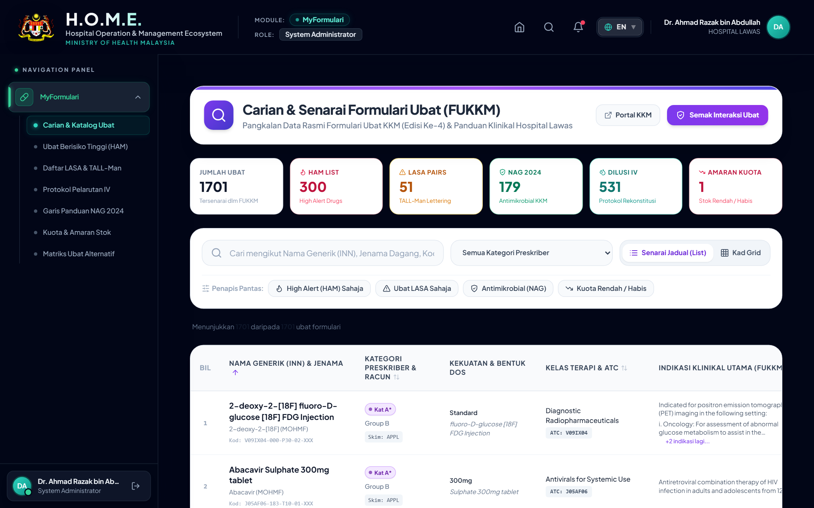
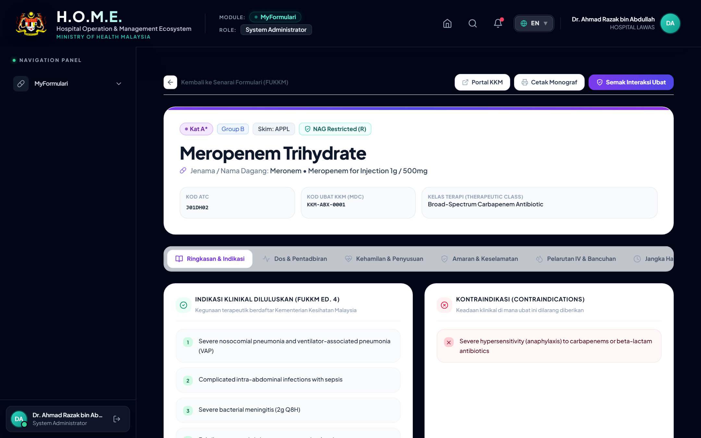
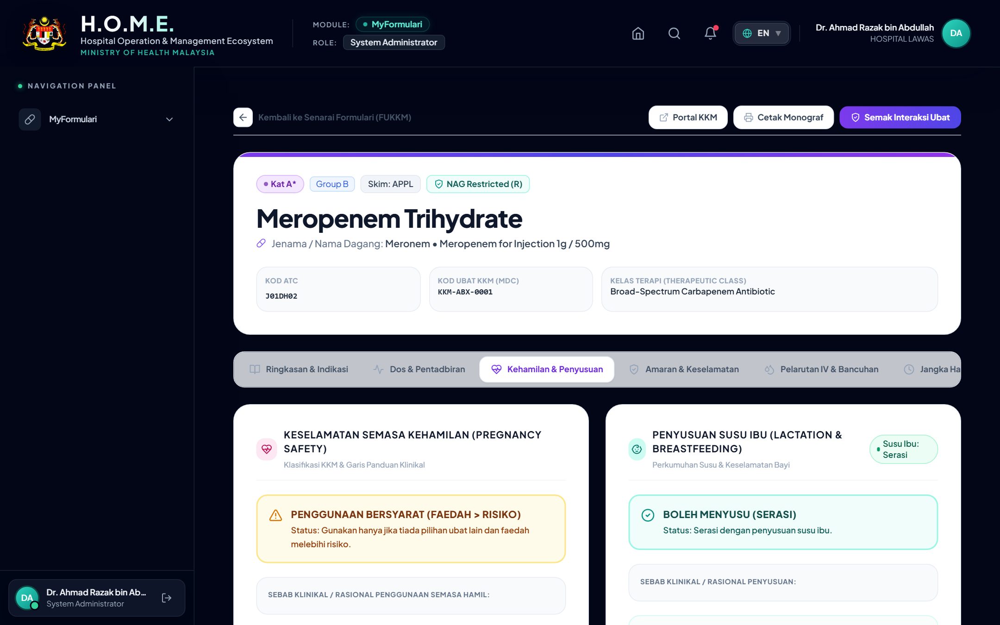
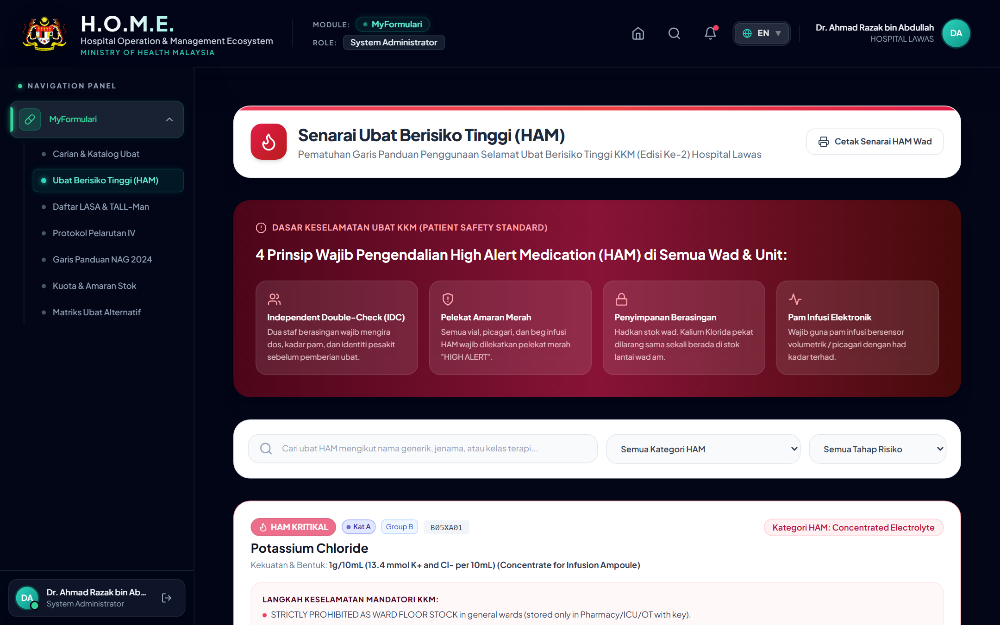
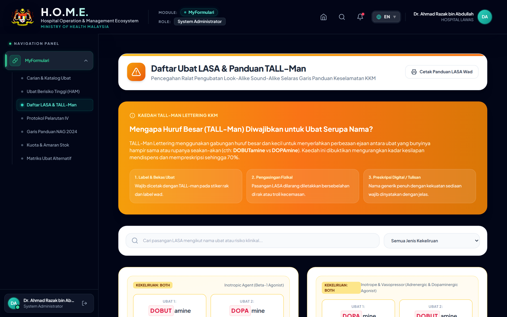
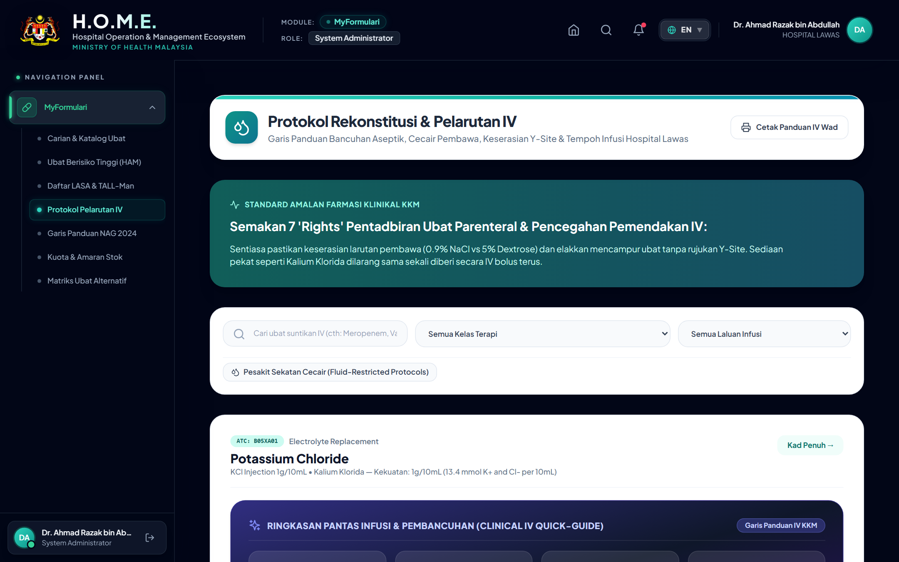
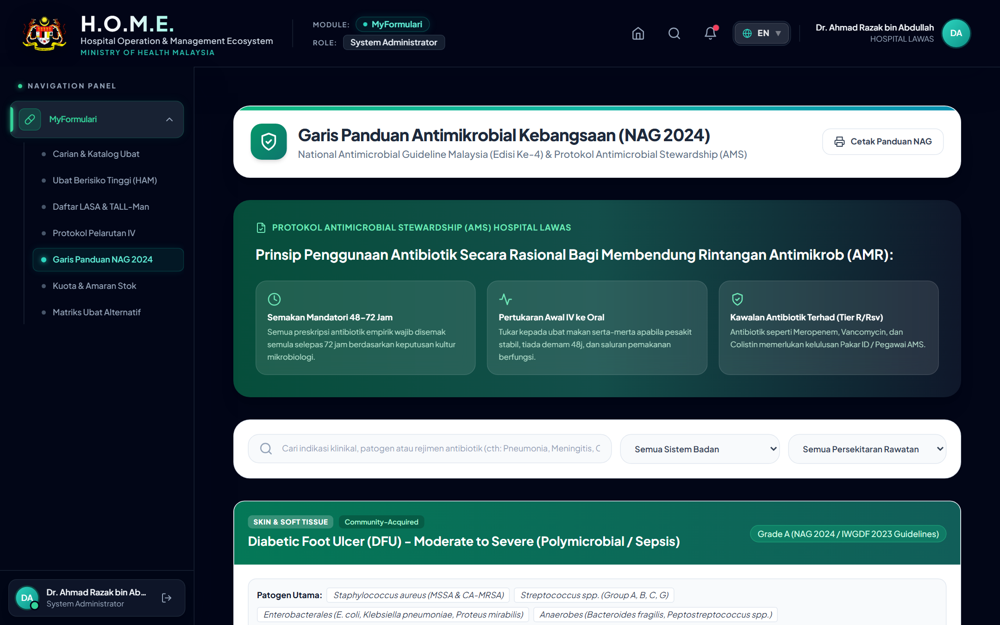
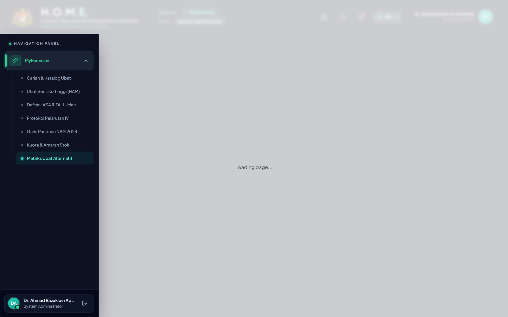
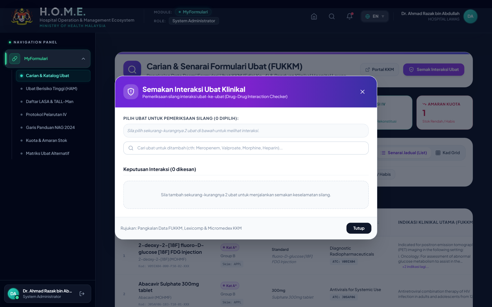

# PANDUAN PENGGUNA LENGKAP & STANDARD OPERATING PROCEDURE (SOP)
## MODUL MYFORMULARI — HOSPITAL OPERATION MANAGEMENT ECOSYSTEM (H.O.M.E.)
### KEMENTERIAN KESIHATAN MALAYSIA (KKM) — HOSPITAL LAWAS, SARAWAK

---

## 📌 MAKLUMAT KAWALAN DOKUMEN & SISTEM
* **Sistem Induk**: Hospital Operation Management Ecosystem (H.O.M.E.)
* **Modul Klinikal**: MyFormulari (Pengkatalogan & Keselamatan Ubat)
* **Pangkalan Data Rujukan**: Formulari Ubat KKM (FUKKM Edisi Ke-4), Garis Panduan HAM (Edisi Ke-2), National Antimicrobial Guideline (NAG 2024)
* **Fasiliti**: Jabatan Farmasi & Semua Wad Klinikal, Hospital Lawas
* **Status Gambar**: **100% Tangkapan Skrin Sebenar Daripada Sistem MyFormulari**
* **Sesi Kuatkuasa**: Sesi Operasi 2026 / 2027
* **Sasaran Pengguna**: Pegawai Perubatan (Pakar & MO), Pegawai Farmasi Klinikal, Penolong Pegawai Farmasi, Jururawat Terlatih, Penolong Pegawai Perubatan (PPP)
* **Lokasi Fail Microsoft Word (.docx)**: `docs/manuals/PANDUAN_LENGKAP_PENGGUNA_MYFORMULARI_KKM.docx`

---

## 📑 JADUAL KANDUNGAN PANDUAN PENGGUNA
1. **BAB 1**: Pengenalan & Objektif Sistem MyFormulari
2. **BAB 2**: Navigasi Module Hub & Pilihan Menu Klinikal
3. **BAB 3**: Papan Pemuka Carian FUKKM & Kategori Preskriber
4. **BAB 4**: Monograf Klinikal Ubat Terperinci & 8 Tab Klinikal
5. **BAB 5**: Pengendalian Ubat Berisiko Tinggi (*High Alert Medication - HAM*)
6. **BAB 6**: Daftar Ubat LASA & Protokol TALL-Man Lettering
7. **BAB 7**: Pusat Protokol Rekonstitusi, Pelarutan IV & Keserasian Y-Site
8. **BAB 8**: Garis Panduan Antimikrobial Kebangsaan (*NAG 2024*) & AMS
9. **BAB 9**: Pemantauan Kuota Fasiliti & Amaran Stok Rendah
10. **BAB 10**: Matriks Ubat Alternatif & Semakan Interaksi Ubat

---

## 🏥 BAB 1: PENGENALAN SISTEM MYFORMULARI

Modul **MyFormulari** merupakan pusat sehenti klinikal bagi rujukan ubat, keselamatan preskripsi, dan protokol farmaseutikal di bawah Hospital Operation Management Ecosystem (H.O.M.E.) Hospital Lawas. Sistem ini mematuhi sepenuhnya piawaian Formulari Ubat KKM (FUKKM Edisi Ke-4) dan Garis Panduan Keselamatan Ubat Kebangsaan.

### 1.1 Objektif Utama Modul
1. **Rujukan Rasmi FUKKM**: Menyediakan maklumat ubat rasmi KKM yang tepat, pantas, dan lengkap kepada doktor, ahli farmasi, dan jururawat.
2. **Keselamatan Pesakit (*Patient Safety*)**: Mencegah kesilapan pemberian ubat melalui amaran visual High Alert Medication (HAM) dan huruf TALL-Man bagi Look-Alike Sound-Alike (LASA).
3. **Kawalan Preskriber**: Memastikan ubat dipreskrib mengikut kategori kuasa yang sah (A*, A, A/KK, B, C, C+).
4. **Standard Protokol IV**: Menyeragamkan kaedah bancuhan serbuk vial, pelarutan IV, kepekatan maksima sekatan cecair, dan keserasian tiub Y-site.
5. **Panduan NAG 2024**: Menyokong program Antimicrobial Stewardship (AMS) dengan panduan empirik mengikut sistem badan dan semakan 72 jam.

> ⚠️ **DASAR KESELAMATAN HOSPITAL LAWAS**  
> Semua anggota klinikal dimestikan membuat semakan dos, laluan, dan keserasian infusi dalam MyFormulari sebelum sebarang ubat suntikan atau berisiko tinggi diberikan kepada pesakit.

---

## 🖥️ BAB 2: NAVIGASI MODULE HUB & SUB-MENU KLINIKAL

Pengguna boleh mengakses MyFormulari daripada Module Hub utama dengan mengklik kad berlabel **"MyFormulari"**. Sistem akan membuka Sub-Menu Pilihan Modul Klinikal yang membahagikan ciri-ciri utama kepada 7 kad fungsi khusus:

1. **Carian & Pengkatalogan Formulari**: Carian menyeluruh mengikut nama generik, jenama, kod ATC, indikasi, dan kategori preskriber.
2. **Senarai Ubat Berisiko Tinggi (HAM)**: Daftar ubat berisiko tinggi beserta SOP Semakan Berganda (IDC).
3. **Daftar Ubat LASA & TALL-Man**: Senarai pasangan ubat rupa serupa / bunyi serupa dengan penonjolan huruf TALL-man.
4. **Pusat Protokol Rekonstitusi & Pelarutan IV**: Panduan bancuhan aseptik, pelarut yang serasi, kepekatan maksima sekatan cecair, dan keserasian Y-site.
5. **Garis Panduan Antimikrobial (NAG 2024)**: Rejimen empirik lini pertama & kedua mengikut sistem badan dan kriteria tukar IV-ke-Oral.
6. **Pemantauan Kuota & Amaran Stok**: Pengesanan baki kuota bulanan fasiliti dan amaran stok rendah.
7. **Matriks Ubat Alternatif**: Matriks ubat pengganti setara kelas semasa ketiadaan stok.

*Paparan Sebenar Sistem 2.1: Sub-Menu MyFormulari di Module Hub — Menampilkan 4 Kad Metrik Utama dan 7 Pilihan Sub-Modul Klinikal*

---

## 🔍 BAB 3: PAPAN PEMUKA CARIAN & PENAPISAN FUKKM

Halaman Papan Pemuka Carian (`/formulari/dashboard`) membolehkan anggota klinikal mencari dan menapis lebih 1,420 ubat berdaftar dengan pantas.

### 3.1 Panduan Penggunaan Bar Carian & Penapis
1. **Kotak Carian Pintar**: Taip mana-mana nama generik (contoh: "ceftriaxone", "amoxicillin", "furosemide") atau nama jenama dagang.
2. **Penapis Preskriber**: Pilih kategori preskriber yang diingini (SEMUA, A*, A, A/KK, B, C, C+) untuk menyaring kelayakan preskripsi.
3. **Suis Penapis Keselamatan**: Tandakan penapis khas untuk melihat ubat HAM sahaja, ubat LASA sahaja, antibiotik NAG sahaja, atau ubat yang berstatus stok rendah.
4. **Suis Mod Paparan (Table / Grid)**: Klik butang ikon di penjuru kanan atas untuk bertukar antara paparan jadual data atau grid kad visual.

### 3.2 Matriks Kuasa Preskriber KKM
| Kategori | Pangkat / Kelayakan Preskriber | Tahap Kawalan | Contoh Ubat |
| :--- | :--- | :--- | :--- |
| **A\*** | Pakar Perunding Kanan / Sub-Kepakaran | Kawalan Tertinggi (Specialist Only) | Meropenem, Linezolid, Chemotherapy |
| **A** | Semua Pegawai Perubatan Pakar | Kawalan Pakar Disiplin | Ceftriaxone, Enoxaparin, Amiodarone |
| **A/KK** | Pakar Hospital & Pakar Family Medicine (FMS) | Pakar Hospital & Klinik Kesihatan | Insulin Glargine, Telmisartan |
| **B** | Semua Pegawai Perubatan (MO) | Preskripsi Am Doktor | Amoxicillin/Clav, Metformin, Amlodipine |
| **C** | Pegawai Perubatan, PPP & Jururawat | Rawatan Asas / Dispensari | Paracetamol, ORS, Chlorpheniramine |
| **C+** | Penggunaan Protokol Kecemasan Khas | Kecemasan / Kebenaran Khas | Adrenaline (Anafilaksis), IV Normal Saline |

*Paparan Sebenar Sistem 3.1: Papan Pemuka Carian & Pengkatalogan Formulari Ubat (FUKKM Edisi Ke-4) Hospital Lawas*

---

## 💊 BAB 4: MONOGRAF KLINIKAL UBAT TERPERINCI

Mengklik mana-mana ubat akan membuka **Monograf Klinikal Lengkap** (`/formulari/drug/:id`). Monograf ini disusun secara sistematik ke dalam 8 tab interaktif:

* **Tab 1: Ringkasan & Indikasi**: Menampilkan kod rasmi KKM, kod ATC, skim perolehan (APPL/CCDP/LP), kategori racun, indikasi klinikal, dan kontraindikasi.
* **Tab 2: Dos & Pentadbiran**: Dos dewasa, dos pediatrik (mg/kg), laluan pentadbiran, kesan sampingan, dan kalkulator Cockcroft-Gault CrCl terbina dalam.
* **Tab 3: Kehamilan & Penyusuan**: Status Kehamilan (BOLEH / WASPADA / DILARANG) dengan penerangan trimester, kategori FDA (A/B/C/D/X), status penyusuan ibu, dan alternatif selamat.
* **Tab 4: Amaran & Keselamatan HAM/LASA**: Amaran keselamatan pesakit, status HAM, dan pasangan keliru LASA.
* **Tab 5: Pelarutan IV & Bancuhan**: Kaedah bancuhan vial serbuk, pelarut yang serasi, kepekatan maksima, dan keserasian tiub Y-site.
* **Tab 6: Jangka Hayat & Storan**: Suhu penyimpanan rasmi, jangka hayat asal, kestabilan selepas dibancuh, dan polisi Multi-Dose Vial (28 hari).
* **Tab 7: Panduan NAG (Antimikrobial)**: Tingkatan sekatan NAG (Free/Restricted/Reserve), kriteria tukar IV-ke-Oral, dan semakan 72 jam AMS.
* **Tab 8: Ubat Alternatif**: Cadangan ubat pengganti setara terapeutik sekiranya ubat mengalami kehabisan bekalan.

*Paparan Sebenar Sistem 4.1: Monograf Klinikal Ubat (Ceftriaxone Sodium 1g Injection) — Tab Ringkasan, Indikasi & Kategori Preskriber*

### 4.1 Panduan Keselamatan Kehamilan & Penyusuan Ibu
Tab Kehamilan & Penyusuan memberikan status Crystal Clear yang mudah difahami oleh preskriber bagi mengelakkan risiko teratogenik kepada janin dan bayi:

*Paparan Sebenar Sistem 4.2: Tab Kehamilan & Penyusuan — Status Keselamatan Trimester, Nasihat Pemantauan Bayi & Alternatif Selamat*

---

## 🚨 BAB 5: PENGENDALIAN UBAT BERISIKO TINGGI (HAM)

Halaman Senarai Ubat Berisiko Tinggi (`/formulari/ham`) menyenaraikan semua ubat yang memerlukan kawalan rapi bagi mengelakkan kemudaratan maut kepada pesakit.

### 5.1 4 Prinsip Wajib Pengendalian HAM di Wad & Unit
1. **Label Merah Mandatori**: Semua ampul, botol infusi, dan picagari HAM mesti dilekatkan pelekat merah menyala berlabel "HIGH ALERT MEDICATION".
2. **Pengasingan Storan Berkunci**: Elektrolit pekat dan NMBA DILARANG disimpan di meja rawatan terbuka. Mesti disimpan dalam laci/loker berkunci khas.
3. **Independent Double Check (IDC)**: Dua jururawat berdaftar atau seorang doktor dan jururawat WAJIB menyemak secara bebas: Nama Pesakit, Nama Ubat, Dos, Kiraan Kepekatan, dan Had Laju Pam Infusi.
4. **Larangan Bancuhan Awal**: Dilarang membancuh ubat HAM lebih awal tanpa arahan khusus pesakit tertentu bagi mengelakkan kekeliruan picagari.

*Paparan Sebenar Sistem 5.1: Halaman Senarai Ubat Berisiko Tinggi (HAM) — Menampilkan 4 Prinsip Keselamatan KKM & Daftar Ubat*

---

## 🔤 BAB 6: DAFTAR UBAT LASA & PROTOKOL TALL-MAN LETTERING

Halaman Daftar Ubat LASA (`/formulari/lasa`) memaparkan pasangan ubat rupa serupa / bunyi serupa dengan penonjolan huruf TALL-man untuk mengelakkan kesilapan pendispensan di farmasi dan wad.

*Paparan Sebenar Sistem 6.1: Daftar Pasangan Ubat LASA & Panduan Huruf TALL-Man Lettering KKM*

---

## 💧 BAB 7: PUSAT PROTOKOL REKONSTITUSI & PELARUTAN IV

Halaman Protokol Pelarutan IV (`/formulari/dilution`) menyediakan rujukan lengkap bancuhan ubat suntikan aseptik, pelarut yang serasi (Water for Injection, Normal Saline 0.9%, Dextrose 5%), isipadu sesaran serbuk, kepekatan maksima sekatan cecair, dan keserasian tiub Y-site.

*Paparan Sebenar Sistem 7.1: Pusat Protokol Rekonstitusi, Pelarutan IV & Keserasian Y-Site*

---

## 🛡️ BAB 8: GARIS PANDUAN ANTIMIKROBIAL KEBANGSAAN (NAG 2024)

Halaman Garis Panduan NAG (`/formulari/antimicrobial`) memaparkan rejimen empirik lini pertama dan kedua mengikut sistem badan (Respiratori, Saluran Kencing, Kulit & Tisu Lembut, Sistem Saraf, Intra-Abdominal, Sepsis, dan Profilaksis Surgeri SAP).

### 8.1 Protokol Semakan 72 Jam Antimicrobial Stewardship (AMS)
1. **Hari 0**: Mulakan antibiotik empirik berspektrum sesuai dan hantar spesimen kultur sebelum dos pertama.
2. **24 - 48 Jam**: Semak keputusan awal pewarnaan Gram dan kultur darah/urin.
3. **72 Jam (Mandatori)**: Lakukan penilaian semula mandatori: De-eskalasi kepada antibiotik berspektrum sempit, laras dos renal, atau tukar kepada antibiotik oral sekiranya pesakit stabil.

*Paparan Sebenar Sistem 8.1: Garis Panduan Antimikrobial Kebangsaan (NAG 2024) Mengikut Sistem Badan*

---

## 📊 BAB 9: PEMANTAUAN KUOTA FASILITI & AMARAN STOK

Halaman Pemantauan Kuota (`/formulari/quota`) membolehkan pihak farmasi dan pentadbiran hospital menjejak peratusan penggunaan kuota bulanan ubat, paras amaran stok rendah, serta unjuran baki hari sebelum stok habis.

*Paparan Sebenar Sistem 9.1: Halaman Pemantauan Kuota Bulanan Fasiliti & Amaran Stok Rendah*

---

## 📑 BAB 10: MATRIKS UBAT ALTERNATIF & SEMAKAN INTERAKSI

Sekiranya berlaku gangguan bekalan ubat, halaman Matriks Ubat Alternatif (`/formulari/alternatives`) menyarankan ubat pengganti setara terapeutik yang diluluskan KKM.

*Paparan Sebenar Sistem 10.1: Matriks Ubat Alternatif & Cadangan Penggantian Terapeutik KKM*

### 10.1 Alat Semak Interaksi Ubat (Drug Interaction Modal)
Butang **"Semak Interaksi Ubat"** pada bahagian atas Papan Pemuka membolehkan pengguna memilih 2 atau lebih ubat untuk mengesan interaksi berbahaya secara automatik:

*Paparan Sebenar Sistem 10.2: Modal Semakan Interaksi Ubat — Mengesan Interaksi Ubat Berbahaya Secara Automatik*

---

## ✍️ PENGESAHAN & KELULUSAN DOKUMEN

| Disediakan Oleh: | Disemak & Disahkan Oleh: | Diluluskan Oleh: |
| :--- | :--- | :--- |
| ........................................................ | ........................................................ | ........................................................ |
| **PEGAWAI FARMASI KLINIKAL (UF48/UF52)** | **KETUA UNIT FARMASI (UF54)** | **PENGARAH HOSPITAL (GRED UTAMA/UD54)** |
| Jabatan Farmasi, Hospital Lawas | Hospital Lawas, Sarawak | Hospital Lawas, Sarawak |
