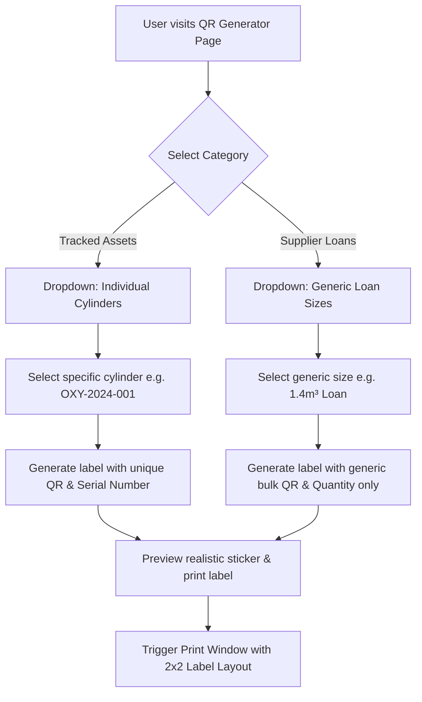

# Implementation Plan: Cylinder QR Label Generator Modernization

Redesign the **Cylinder QR Label Generator** sub-module inside the Medical Oxygen Dashboard to match the project's premium golden reference design system (PO style). Additionally, refactor the cylinder selection logic to separate tracked asset cylinders from supplier loan cylinders (1.4m³ and 8.0m³), providing generic quantity-scan QR codes for loans instead of tracking individual cylinders.

## User Review Required

Document anything that requires user review or feedback.
> [!IMPORTANT]
> - **Generic QR Payload Representation**: For the 1.4m³ and 8.0m³ loan cylinders, scanning will produce a generic text payload (`LOAN-1.4M3-GENERIC` and `LOAN-8.0M3-GENERIC`) rather than an individual database asset ID.
> - **Print Layout Scale**: The printable window will format a standard 2" x 2" (50mm x 50mm) label layout with print-only media stylesheets to fit thermal sticker printers natively.

## Workflow & Logic Architecture

### Mermaid Diagram


### ASCII Layout Design
```text
+---------------------------------------------------------------------------------------------------------+
|                                  CYLINDER QR LABEL GENERATOR REDESIGN                                  |
+---------------------------------------------------------------------------------------------------------+
| [ Ambient Radial Light Blur ]                                                                           |
|                                                                                                         |
| PHARMACY > INVENTORY > DISTRIBUTION                                                                     |
|                                                                                                         |
| ( Rotating Icon )   Cylinder QR Label Generator                                                         |
|                     Generate unique tracking labels for assets or generic quantity labels for loans.    |
|                                                                                                         |
| +-------------------------------------------------------+ +-------------------------------------------+ |
| | [Selector Card: Rounded-[2.5rem]]                     | | [Preview Card: Rounded-[2.5rem]]          | |
| |                                                       | |                                           | |
| |   1. Select Category (Tactile Slide Toggle)           | |   If Empty:                               | |
| |   [ Tracked Assets ] [ Supplier Loans ]               | |   +-----------------------------------+   | |
| |                                                       | |   | [ Pulsing Scan Line ]             |   | |
| |   2. Choose Cylinder (Custom Rounded Dropdown)        | |   | Please select a cylinder to ...   |   | |
| |   +-----------------------------------------------+   | |   +-----------------------------------+   | |
| |   | -- Choose Cylinder --                       v |   | |                                           | |
| |   +-----------------------------------------------+   | |   If Generated:                           | |
| |                                                       | |   +-----------------------------------+   | |
| |   [Button: Generate Printable Label]                  | |   |        KKM MEDICAL OXYGEN         |   | |
| |   - Tactile scale, hover glow animation               | |   |                                   |   | |
| |                                                       | |   |      [ REAL DYNAMIC QR CODE ]     |   | |
| |                                                       | |   |       (api.qrserver.com API)      |   | |
| |                                                       | |   |                                   |   | |
| |   |  Serial: LOAN-1.4M3-GENERIC                       | |   |  Serial: LOAN-1.4M3-GENERIC       |   | |
| |   |  Type: Loan 101-F (1.4M³)                         | |   |  Type: Loan 101-F (1.4M³)         |   | |
| |   |  [Badge: GENERIC QUANTITY ONLY]                   | |   |  [Badge: GENERIC QUANTITY ONLY]   |   | |
| |   +-----------------------------------------------+   | |   +-----------------------------------+   | |
| |                                                       | |   | [Icon] Print Scan Label           |   | |
| |   [Button: Print Scan Label]                          | |   |                                   |   | |
| +-------------------------------------------------------+ +-------------------------------------------+ |
+---------------------------------------------------------------------------------------------------------+
```

---

## Proposed Changes

### UI & Styling Modernization

#### [MODIFY] [OxygenDashboardPage.tsx](file:///c:/Users/60113/Downloads/My%20Home/hospital-operation-management-ecosystem/src/pages/pharmacy/oxygen/OxygenDashboardPage.tsx)

1. **State Addition**:
   - `const [qrCategory, setQrCategory] = useState<'assets' | 'loans'>('assets')`
   - Automatically reset selection when switching tabs.

2. **Dropdown Filtering & Selection**:
   - Filter out cylinders belonging to loan sizes from the individual selector:
     `const standardCylinders = cylinders.filter(c => !c.size_info?.is_loan)`
   - When **Tracked Assets** is active:
     - Render standard select element populated with `standardCylinders`.
   - When **Supplier Loans** is active:
     - Render dropdown populated with two static options:
       - Value `generic-loan-1.4`: "1.4m³ Loan Cylinder (Generic)"
       - Value `generic-loan-8.0`: "8.0m³ Loan Cylinder (Generic)"

3. **Generate Action Handlers**:
   - When generating from a standard asset: Set `generatedLabel` to selected cylinder database record (standard behavior).
   - When generating from a generic loan size:
     - Create a mock `OxygenCylinderWithRelations` payload:
       ```typescript
       {
         id: 'generic-loan-1.4',
         serial_number: 'LOAN-1.4M3-GENERIC',
         status: 'available',
         qr_code: 'LOAN-1.4M3-GENERIC',
         type_info: { type_code: 'F', type_name: 'Loan 101-F (1.4M³)' },
         size_info: { code: '101-F', capacity: '1.40', unit: 'm3', is_loan: true }
       }
       ```
       (And similar for `8.0` with code `101-N` and capacity `8.00`).

4. **Realistic Label Preview Panel**:
   - Add a subtle background scanner pulse animation in empty state.
   - Use dynamic real QR code image:
     `https://api.qrserver.com/v1/create-qr-code/?size=150x150&data=${encodeURIComponent(generatedLabel.qr_code || generatedLabel.serial_number)}`
   - Render a pill status badge:
     - Standard: "ASSET TAGGED" (emerald color).
     - Loan: "GENERIC LOAN • QUANTITY ONLY" (blue color).

5. **Thermal Print Dialog Implementation**:
   - Clicking "Print Scan Label" opens a print window:
     - Renders a clean sticker layout with CSS print media overrides (`@page { size: 2in 2in; margin: 0; }`).
     - Loads a clean QR image and uses clean sans-serif/monospace typography.
     - Triggers window print and automatically closes the dialog after window focus.

---

## Verification Plan

### Automated Build Checks
- Run compiler checks: `npm run build` or Vite typechecks.

### Manual Verification
- Select "Tracked Assets" -> Check that loan cylinders (serial numbers starting with `101-N-` or `101-F-`) are excluded.
- Select "Supplier Loans" -> Check that "1.4m³ Loan Cylinder (Generic)" and "8.0m³ Loan Cylinder (Generic)" are shown.
- Click "Generate Printable Label" for both types, check that the dynamic QR code is rendered and is scan-ready.
- Click "Print Scan Label" -> Check that the browser print dialog is triggered with a clean sticker layout.
