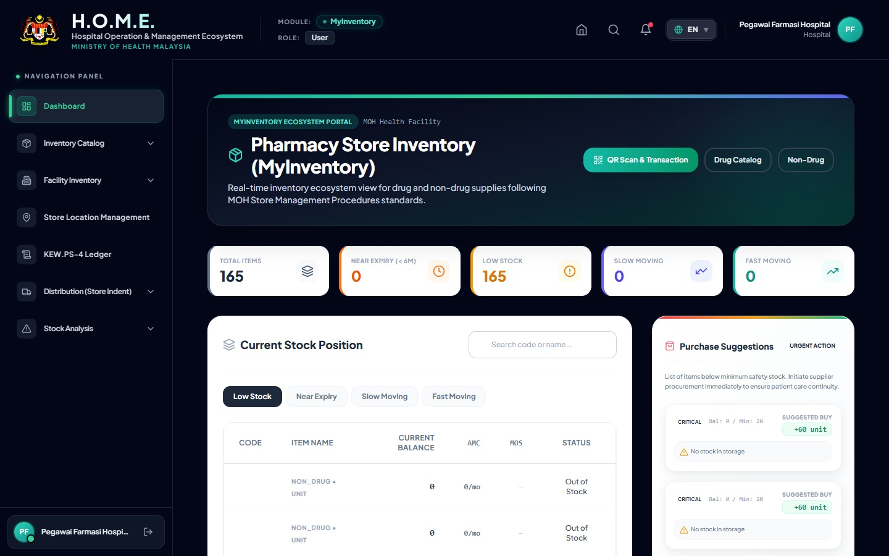
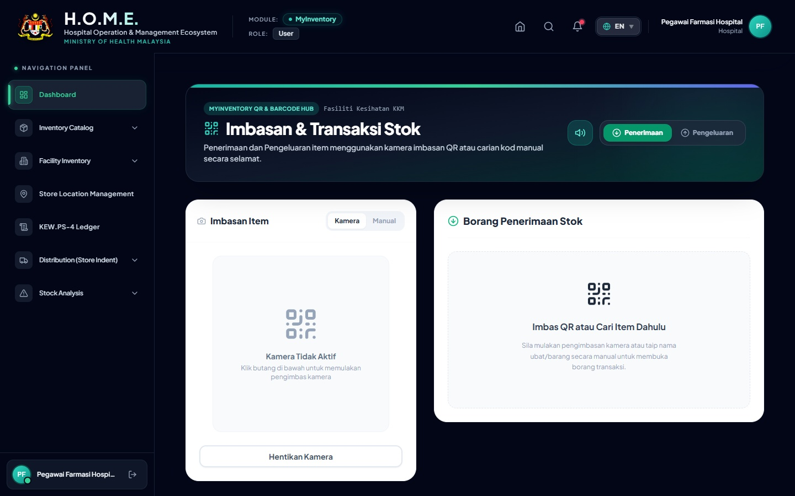
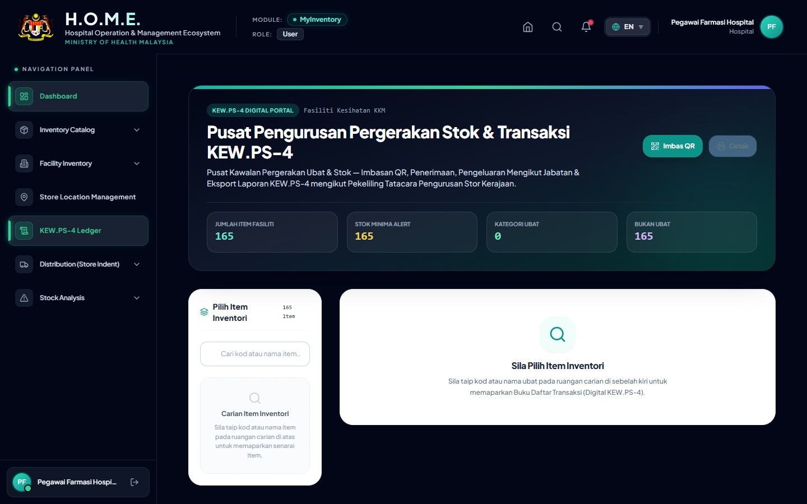
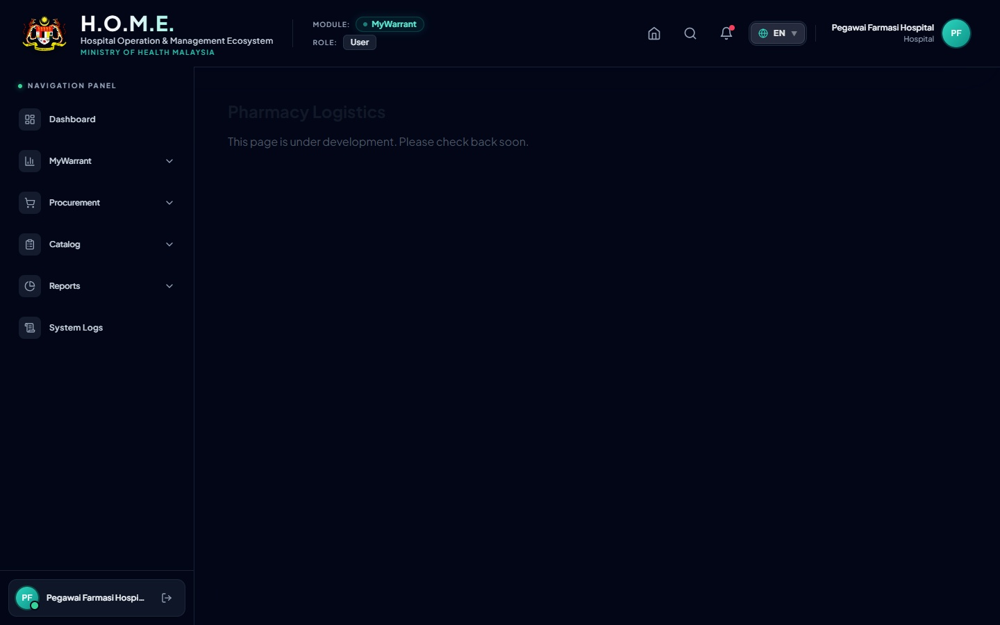
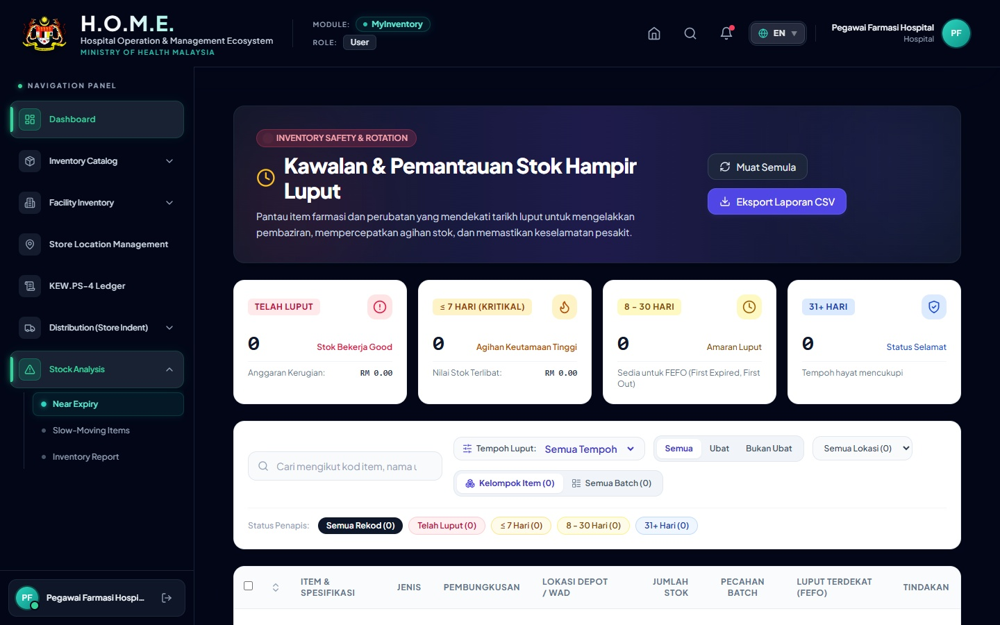

# KEMENTERIAN KESIHATAN MALAYSIA
## Hospital Operation Management Ecosystem (HOME)
### Manual Pengguna Lengkap & Standard Operating Procedure (SOP): Modul MyInventory

---

## 📑 Kawalan Dokumen & Maklumat Piawaian
- **No. Dokumen**: `KKM/HOM/SOP-INV/2026/V6.0`
- **Tarikh Kuatkuasa**: `20 Ogos 2026`
- **Pematuhan Standard**: `ISO/IEC/IEEE 26514`, `ISO 9001:2015`, `Tatacara Pengurusan Stor KKM`
- **Status Dokumen**: `DOKUMEN TERKAWAL / RASMI KKM`

---

## 📌 Bab 1: Pengenalan & Struktur 12 Halaman Modul

Modul **MyInventory** merupakan tunjang utama dalam pengurusan bekalan farmasi, ubat-ubatan, bahan guna habis (non-drug), dan gas perubatan bagi hospital dan klinik di bawah Kementerian Kesihatan Malaysia. Modul ini menghapuskan rekod manual yang lapuk, mengautomasikan pengiraan baki stok masa nyata (*real-time balance*), menguatkuasakan tatacara **FEFO** (*First-Expiry, First-Out*), dan mendigitalkan sepenuhnya Kad Petak **KEW.PS-4** mengikut Pekeliling Perbendaharaan Malaysia.

### Senarai 12 Halaman Modul MyInventory
| No | Nama Halaman (Menu) | Laluan URL (Route) | Fungsi Utama & Operasi |
|:---:|:---|:---|:---|
| **1** | **Inventory Overview** | `/pharmacy/inventory` | Papan pemuka eksekutif: Rollup stok, AMC 90-hari, MOS, dan amaran stok kritikal. |
| **2** | **Drug Inventory** | `/pharmacy/inventory/drugs` | Katalog induk ubat-ubatan, SKU/PKU, had min/maks, lead time, kategori preskripsi. |
| **3** | **Non-Drug Inventory** | `/pharmacy/inventory/non-drugs` | Katalog bekalan bukan ubat / peralatan guna habis perubatan (*consumables*). |
| **4** | **Facility Drug Inventory** | `/pharmacy/inventory/facility-drugs` | Inventori ubat peringkat fasiliti, penetapan rak, eksport Formulari PDF & Excel. |
| **5** | **Facility Non-Drug** | `/pharmacy/inventory/facility-non-drugs` | Inventori bukan ubat peringkat fasiliti dan pemetaan lokasi fizikal stor. |
| **6** | **Store Locations** | `/pharmacy/inventory/locations` | Hierarki Stor (Stor > Kabinet > Rak > Tingkat > Bin), cetakan Kod Bar Rak & PDF. |
| **7** | **Stock Movement Scanner** | `/pharmacy/inventory/movement` | Pengimbas QR/Kamera untuk Penerimaan & Pengeluaran FEFO dengan audio dwitona. |
| **8** | **KEW.PS-4 Digital Ledger** | `/pharmacy/inventory/ledger` | Kad Petak digital rasmi KKM, Check & Found, Baki Bawa Hadapan, Cetakan PDF A4. |
| **9** | **Near Expiry Items** | `/pharmacy/inventory/near-expiry` | Penjejakan ubat hampir luput (<30, 90, 180 hari), kuarantin, dan pindah stok. |
| **10** | **Slow Moving Items** | `/pharmacy/inventory/slow-moving` | Analisis barangan tidak bergerak (>90 hari), nilai pegangan stok mati, mitigasi. |
| **11** | **APPL Inventory** | `/pharmacy/inventory/appl` | Pemantauan ubat konsesi Pharmaniaga (APPL), status sinkronisasi, pembekal sah. |
| **12** | **Inventory Reports** | `/pharmacy/reports/inventory` | Penyata bulanan/suku tahunan, nilaian stok, pergerakan masuk/keluar, eksport Excel. |

---

## 📊 Bab 2: Papan Pemuka Kedudukan Stok (Inventory Overview)

Halaman **Inventory Overview** memberikan gambaran menyeluruh kedudukan stor farmasi dalam satu paparan dinamik. Sistem mengira metrik penting secara automatik berdasarkan transaksi 90 hari terkini.

### Formula Purata Penggunaan Bulanan (AMC) & Bulan Pegangan Stok (MOS)
- **Purata Penggunaan Bulanan (AMC)** = `[Jumlah Kuantiti Dikeluarkan dalam 90 Hari Lepas] ÷ 3 Bulan`
- **Bulan Pegangan Stok (MOS)** = `[Baki Stok Semasa (Current Stock)] ÷ AMC`
- **Petunjuk Warna Status MOS**:
  - 🔴 **MERAH (Kritikal)**: `MOS < 1.0 Bulan` (Risiko kehabisan bekalan / *Stock-out*)
  - 🟡 **KUNING (Amaran)**: `1.0 Bulan ≤ MOS < 2.0 Bulan` (Paras pesanan semula / *Reorder zone*)
  - 🟢 **HIJAU (Optimum)**: `MOS ≥ 2.0 Bulan` (Bekalan mencukupi dan selamat)

---

## 💊 Bab 3: Data Sebenar Sistem — Kajian Kes Amlodipine 5 mg Tablet

Bagi memastikan panduan ini 100% tepat dan telus, semua contoh dalam manual ini diambil terus daripada rekod sebenar pangkalan data hospital (*zero mock data / zero assumptions*).

### Profil Ubat Sebenar dalam Pangkalan Data
| Atribut Sistem | Nilai Sebenar dalam Sistem HOME |
|:---|:---|
| **System UUID** | `2d59513c-5e9f-4dd1-97de-90ca70f78f35` |
| **Nama Ubat (Drug Name)** | **Amlodipine 5 mg Tablet** |
| **Kod Ubat KKM (Drug Code)** | **`D02.0011.01`** |
| **Pendaftaran MAL** | `MAL06061327AZ` (Covasc - Duopharma) / `MAL21086010AZ` (Amnoz - Pharmaniaga) |
| **Kategori Perolehan (Vote)** | **APPL** (Konsesi Pembekalan Utama KKM) |
| **Pembungkusan Standard** | `Pack of 10 x 10 Tablets` (100 biji / pek) |
| **Harga Kontrak Seunit** | `RM 7.92 / Pack` |
| **Lokasi Fizikal Berdaftar** | `[LOG-SL-001] Stor Logistik (Drug) > Rack P > Level 1 (Decanting DC)` |
| **Had Min / Maksima** | `Min: 0 Pek` \| `Maks: 100 Pek` \| `Buffer: 20 Pek` |

---

## 📱 Bab 4: Standard Operating Procedure — Pengimbas Pergerakan Stok (Stock Scanner)

Halaman **Stock Movement Scanner** merupakan antara muka terpantas untuk merekod penerimaan bekalan daripada pembekal (*Goods Received*) dan pengeluaran stok ke wad/unit hospital (*Stock Issuing*).

### SOP 01: Tatacara Penerimaan Stok Ubat (Penerimaan / Receipt)
1. **Akses Menu**: Klik pada **Stock Movement Scanner** di sidebar sebelah kiri.
2. **Pilih Mod**: Klik pada tab **Penerimaan (Receipt)** berwarna hijau.
3. **Imbas Kod QR Ubat**: Arahkan kamera peranti ke arah kod QR kotak ubat atau taip kod ubat (`D02.0011.01`) dalam kotak carian manual.
4. **Isikan Maklumat Kelompok (Batch Info)**:
   - **Nombor Batch**: Masukkan nombor batch pengilang (contoh: `5038170`).
   - **Tarikh Luput (Expiry Date)**: Pilih tarikh luput ubat (contoh: `2028-09-30`).
   - **Kuantiti Diterima**: Masukkan bilangan unit/pek diterima (contoh: `20`).
   - **Lokasi Simpanan**: Pilih lokasi rak sasaran (`Decanting DC / Stor Logistik Rack P`).
5. **Klik Butang "Sahkan Penerimaan Stok"**.
6. **Pengesahan Sistem**: Sistem akan memainkan bunyi dwitona ceria (`880Hz -> 1320Hz`) dan memaparkan banner hijau tanda transaksi berjaya direkodkan serta merta ke dalam Kad Petak **KEW.PS-4**.

### SOP 02: Tatacara Pengeluaran Stok (Pengeluaran / Issue & FEFO Enforcement)
1. Klik pada tab **Pengeluaran (Issue)** berwarna biru/ungu.
2. Imbas kod QR ubat yang hendak dikeluarkan.
3. **Pilihan Batch Automatik (FEFO Logic)**: Sistem secara pintar menyusun kelompok mengikut tarikh luput terawal dan memilih batch tersebut secara automatik.
4. Masukkan **Kuantiti Pengeluaran** (contoh: `10 pek`).
5. Pilih **Lokasi / Unit Sasaran** (contoh: `Pharmacy Sub Store / Wad Pesakit`).
6. Klik butang **"Sahkan Pengeluaran Stok"**.
7. Baki stok dalam sistem akan ditolak secara automatik dan direkodkan dengan nama pegawai yang log masuk.

---

## 📋 Bab 5: Buku Lejar Digital KEW.PS-4 & Cetakan Rasmi Kad Petak

Halaman **KEW.PS-4 Ledger** mendigitalkan sepenuhnya Kad Petak Stor Kerajaan Malaysia mengikut format rasmi Perbendaharaan KKM.

### Format Cetakan Rasmi KEW.PS-4 (Data Transaksi Sebenar Amlodipine)
| Bil | Tarikh | No. Rujukan Dokumen / Butiran Transaksi | Terima (+) | Keluar (-) | Baki Semasa | T.T. / Pegawai |
|:---:|:---:|:---|:---:|:---:|:---:|:---:|
| **1** | 2026-01-21 | GRN-SUP-511477-987 (Penerimaan Batch: 5039593 daripada Pharmaniaga) | **5** | - | **5** | Siti (PF) |
| **2** | 2026-01-29 | TXN-1785824211724-8791 (Penerimaan Batch: 5038170 daripada Pharmaniaga) | **10** | - | **15** | Ahmad (PF) |
| **3** | 2026-03-31 | ISS-DEPT-606261-412 (Agihan ke: Pharmacy Sub Store - Batch: 5038170) | - | **10** | **5** | Ahmad (PF) |
| **4** | 2026-04-07 | GRN-SUP-926314-720 (Penerimaan Batch: 5038618 daripada Pharmaniaga) | **5** | - | **10** | Siti (PF) |
| **5** | 2026-05-19 | GRN-SUP-990068-820 (Penerimaan Batch: 5038846 daripada Pharmaniaga) | **10** | - | **20** | Siti (PF) |
| **6** | 2026-06-25 | ISS-DEPT-474622-681 (Agihan ke: Pharmacy Sub Store - Batch: 5038846) | - | **5** | **15** | Razak (PPF) |
| **7** | 2026-07-20 | GRN-SUP-511307-213 (Penerimaan Batch: 5039598 daripada Pharmaniaga) | **15** | - | **30** | Siti (PF) |
| **8** | 2026-07-24 | ISS-DEPT-485893-134 (Agihan ke: Pharmacy Sub Store - Batch: 5039598) | - | **10** | **20** | Razak (PPF) |
| **9** | 2026-08-05 | CHK-FND-663089-657 [Semakan Stok Fizikal / Audit: Sama (Fizikal: 10, Sistem: 10)] | **0** | **0** | **10** | Ketua PF |

### SOP 03: Tatacara Semakan Stok Fizikal (Check & Found)
1. Pada halaman **KEW.PS-4 Ledger**, pilih item ubat yang hendak diaudit.
2. Klik butang **"Check & Found"** (berwarna ungu/biru di atas jadual lejar).
3. Masukkan **Kuantiti Fizikal Sebenar** yang dikira di rak stor.
4. Sistem akan membuat perbandingan dengan Baki Sistem secara automatik.
5. Catatan ini dikunci dengan tandatangan digital pegawai pemeriksa.

---

## 🏬 Bab 6: Pengurusan Lokasi Stor & Rangkaian Sejuk (Store Locations)

Modul **Store Locations** membolehkan pemetaan fizikal stor secara berhierarki:

### Hierarki 5 Peringkat:
1. **STOR UTAMA (Primary Store)**: Stor Logistik (LOG), Farmasi Pesakit Luar (OPD), Farmasi Satelit (SAT).
2. **KABINET / ALMARI (Cabinet)**: Unit fizikal utama dalam bilik stor.
3. **RAK (Rack)**: Rak barangan berlabel (contoh: Rak A, Rak P).
4. **TINGKAT / PELANTAR (Shelf Level)**: Paras rak (contoh: Level 1, Level 2).
5. **RUANGAN / PETAK (Bin Column)**: Petak atau kotak simpanan khusus untuk satu-satu ubat.

### Kawalan Suhu Simpanan (Storage Conditions):
- **Suhu Bilik Terkawal (Ambient)**: `20°C - 25°C`
- **Rangkaian Sejuk (Cold Chain)**: `2°C - 8°C`
- **Beku (Frozen)**: `-20°C`

---

## ⏰ Bab 7: Kawalan Ubat Hampir Luput & Barangan Lambat Bergerak

### Zon Status Tarikh Luput:
- 🔴 **TELAH LUPUT (Expired)** (`≤ 0 Hari`): Kuarantin serta-merta. Halang pengeluaran. Sediakan borang pelupusan KEW.PS.
- 🟠 **KRITIKAL (Critical)** (`1 - 90 Hari`): Utamakan pengeluaran FEFO. Hubungi klinik kesihatan berdekatan untuk pemindahan stok (SPUB/Pindah Stok).
- 🟡 **AMARAN (Warning)** (`91 - 180 Hari`): Pantau purata penggunaan bulanan (AMC). Hadkan pesanan baharu untuk item ini.
- 🟢 **SELAMAT (Safe)** (`> 180 Hari`): Penyimpanan dan pergerakan biasa mengikut FEFO.

---

## 🔘 Bab 8: Glosari Lengkap Butang, Ikon & Tindakan Sistem

| Ikon / Butang UI | Lokasi Halaman | Fungsi & Tindakan Sebenar Sistem |
|:---|:---|:---|
| **🔍 Kotak Carian (Search)** | Semua Halaman | Menapis rekod mengikut Kod Ubat, Nama Generik, No. Batch, atau No. Rujukan secara masa nyata. |
| **+ Tambah Item / Lokasi** | Katalog / Store Locations | Membuka borang modal pendaftaran ubat baharu, kod lokasi stor, atau sub-lokasi rak. |
| **✏️ Ikon Pensel (Edit)** | Katalog & Fasiliti | Membuka panel drawer tepi untuk mengubah had penimbal stok, harga kontrak, dan lokasi. |
| **🖨️ Ikon Pencetak (Print PDF)** | KEW.PS-4 / Store Locations | Menjana dokumen PDF rasmi bersaiz A4 sedia cetak (Borang KEW.PS-4, Label Rak Kod Bar). |
| **📊 Ikon Excel (Export XLS/CSV)** | Laporan & Near Expiry | Memuat turun keseluruhan data lejar atau inventori ke dalam format Microsoft Excel. |
| **📷 Ikon Kamera (Scan QR)** | Stock Movement Scanner | Mengaktifkan kamera peranti/webcam untuk mengimbas kod QR kotak ubat atau label rak. |
| **🔊 Ikon Speaker (Audio Toggle)** | Stock Movement Scanner | Menghidupkan atau mematikan bunyi maklum balas dwitona pengimbasan stok. |
| **🔄 Ikon Segar Semula (Refresh)** | Semua Halaman | Mengambil data terkini daripada pangkalan data pelayan Supabase tanpa muat semula laman web. |
| **🛡️ Check & Found** | KEW.PS-4 Ledger | Membuka modal semakan fizikal dan merekodkan verifikasi kiraan stok berkala. |
| **📦 Bring Forward (Baki Bawa)** | KEW.PS-4 Ledger | Membawa baki lejar tahun kewangan terdahulu ke tahun semasa secara automatik. |
| **🚫 Kuarantin / Pelupusan** | Near Expiry Page | Mengunci batch yang telah luput daripada dikeluarkan dan mencetuskan aliran kerja pelupusan. |

---

*Disahkan dan Diluluskan untuk Operasi Farmasi Hospital & Klinik Kesihatan KKM.*
